# 🧠 MindGrade - Predicting Student CGPA from Mental Health Indicators

<div align="center">


> A complete **machine learning pipeline** that processes survey data from 101 university students at the International Islamic University Malaysia (IIUM) to examine the relationship between student mental health conditions (depression, anxiety, panic attacks) and academic CGPA training, comparing, and explaining four classifiers with SHAP-based interpretability and a full PDF research report.

</div>

<div align="center">

[](https://nelvin-predicting-student-cgpa-from-mental-health-indicators.streamlit.app/)

</div>


---

## 📌 Problem

Student mental health is a growing concern in higher education worldwide. Depression, anxiety, and panic attacks are increasingly prevalent among university students, yet their quantifiable impact on academic performance remains underexplored particularly in Southeast Asian academic contexts where self-reporting stigma and limited access to counselling services compound the problem.

At the International Islamic University Malaysia (IIUM), a 2020 survey of 101 students revealed that approximately 1 in 3 students reported each of the three major mental health conditions, yet only **6% sought specialist treatment** a treatment gap that urgently demands institutional attention.

There is a critical need for a **reproducible, transparent, and interpretable machine learning pipeline** that quantifies the relationship between mental health burden and CGPA, identifies the most influential predictive features, and delivers insights that can inform university welfare policy and early intervention strategies.

---

## 🎯 Objective

- Clean and standardise a messy real-world survey dataset (49 raw course names → 7 categories, inconsistent casing, missing values, unencoded categoricals)
- Engineer a composite **Mental Health Burden Score** (0–3) from three binary mental health flags
- Apply **SMOTE oversampling** to handle severe class imbalance across 5 CGPA bands
- Train and compare **four classifiers**: Logistic Regression, Random Forest, XGBoost, SVM
- Evaluate models on **Accuracy, Macro F1, Weighted F1, and ROC-AUC**
- Explain predictions using **SHAP (SHapley Additive exPlanations)** feature importance
- Conduct **chi-square statistical tests** to assess significance of mental health associations
- Generate a complete **PDF research report** with all figures, tables, and key findings

---

## 🗂️ Dataset

The data was collected via **Google Forms** from students at IIUM (International Islamic University Malaysia) in July 2020 and published on Kaggle.

### Dataset Overview

| Parameter | Value |
|-----------|-------|
| Source | Google Forms Survey — IIUM, Malaysia |
| Collection Period | July 2020 |
| Total Respondents | 101 students |
| Original Features | 11 columns |
| Engineered Features | 12 columns (post-cleaning) |
| Target Variable | CGPA band (5 classes) |
| Dataset Link | [Kaggle — Student Mental Health](https://www.kaggle.com/datasets/shariful07/student-mental-health) |

### Feature Description

| Feature | Type | Description |
|---------|------|-------------|
| `gender` | Categorical | Male / Female |
| `age` | Numeric | Student age (18–24) |
| `course` | Categorical | Academic faculty group (7 categories) |
| `year_of_study` | Ordinal | Year 1–4 |
| `marital_status` | Binary | Married (1) / Single (0) |
| `depression` | Binary | Self-reported depression (1/0) |
| `anxiety` | Binary | Self-reported anxiety (1/0) |
| `panic_attack` | Binary | Self-reported panic attacks (1/0) |
| `sought_treatment` | Binary | Sought specialist help (1/0) |
| `mh_burden_score` | Numeric | Engineered: depression + anxiety + panic_attack (0–3) |
| `cgpa` | Categorical | CGPA band label (target — string) |
| `cgpa_label` | Ordinal | CGPA band ordinal encoding (target integer 0–4) |

### CGPA Band Distribution

| CGPA Band | Label | Count | % of Students |
|-----------|-------|-------|---------------|
| 3.50 – 4.00 | 4 | 48 | 47.5% |
| 3.00 – 3.49 | 3 | 43 | 42.6% |
| 0 – 1.99 | 0 | 4 | 4.0% |
| 2.50 – 2.99 | 2 | 4 | 4.0% |
| 2.00 – 2.49 | 1 | 2 | 2.0% |

### Mental Health Prevalence

| Condition | Students Affected | % of Sample |
|-----------|------------------|-------------|
| Depression | 35 | 34.7% |
| Anxiety | 34 | 33.7% |
| Panic Attack | 33 | 32.7% |
| Sought Treatment | 6 | 5.9% |

---

## 🛠️ Tools & Technologies

- **Language:** Python 3.9+
- **Machine Learning:** Scikit-learn — Logistic Regression, Random Forest, SVM; XGBoost
- **Imbalanced Learning:** imbalanced-learn — SMOTE oversampling
- **Explainability:** SHAP — LinearExplainer, feature importance visualisation
- **Data Processing:** Pandas, NumPy
- **Visualisation:** Matplotlib, Seaborn
- **Statistical Testing:** SciPy — chi2_contingency
- **Model Persistence:** Joblib — .pkl model serialisation
- **Reporting:** ReportLab — programmatic PDF generation

---

## ⚙️ Methodology / Project Workflow

1. **Data Loading:** Ingest raw Google Forms survey CSV (101 rows × 11 columns)
2. **Column Renaming:** Standardise all column names to clean snake_case identifiers
3. **Course Grouping:** Map 49 inconsistent raw course names (e.g. "koe", "KOE", "Koe") into 7 faculty categories: Computing & IT, Engineering, Islamic Studies, Social Sciences, Life Sciences, Business & Economics, Sciences
4. **Year Normalisation:** Resolve casing inconsistencies ("year 1" vs "Year 1") and convert to integer (1–4)
5. **CGPA Standardisation:** Strip whitespace from CGPA bands; add ordinal `cgpa_label` (0–4) for ML use
6. **Binary Encoding:** Convert Yes/No responses in 5 columns to 1/0 integer flags
7. **Missing Value Imputation:** Fill 1 missing age with column median (19.0)
8. **Feature Engineering:** Create composite `mh_burden_score` = depression + anxiety + panic_attack (range 0–3)
9. **One-Hot Encoding:** Encode `gender` and `course` categoricals; convert bool columns to int
10. **Train/Test Split:** 80/20 stratified split (80 train, 21 test); `random_state=42`
11. **SMOTE Oversampling:** Apply adaptive SMOTE on training set (k_neighbors = min_class_size − 1) to balance 5 CGPA classes; training set expanded from 80 → 190 rows
12. **Model Training:** Train Logistic Regression (multinomial), Random Forest (200 trees), XGBoost (200 estimators), and SVM (RBF kernel) on resampled training data
13. **Evaluation:** Compute Accuracy, Macro F1, Weighted F1, ROC-AUC per model; generate classification reports and confusion matrices
14. **SHAP Explanation:** Apply LinearExplainer on best model; decompose (21, 17, 5) SHAP array into per-class feature contributions; render stacked horizontal bar chart
15. **Chi-Square Testing:** Test independence of each mental health condition against CGPA band (α = 0.05)
16. **PDF Report Generation:** Programmatically assemble full research report with ReportLab: cover page, stat cards, all 17 figures, both tables, key findings, limitations

---

## 📊 Key Features

- ✅ **Real survey data:** 101 IIUM student responses collected July 2020 — no synthetic data used in modelling inputs
- ✅ **Full cleaning pipeline:** Resolves 49 inconsistent course names, casing errors, missing values, and unencoded categoricals in a reproducible, documented script
- ✅ **Adaptive SMOTE:** Dynamically sets k_neighbors based on smallest class size — handles extreme imbalance (classes with as few as 2 training samples) without crashing
- ✅ **Four-model comparison:** Logistic Regression, Random Forest, XGBoost, and SVM trained and evaluated on identical splits for fair comparison
- ✅ **SHAP interpretability:** Per-class feature importance decomposed from LinearExplainer output (shape 21×17×5) into a readable stacked bar chart showing which features drive each CGPA band prediction
- ✅ **Chi-square statistical testing:** Formal independence tests between all mental health features and CGPA band with results exported to CSV
- ✅ **11 EDA visualisations:** CGPA distribution, gender breakdown, MH prevalence, burden score, MH vs CGPA (per condition), age distribution, year vs CGPA, course heatmap, correlation heatmap
- ✅ **Confusion matrices for all 4 models:** Dynamically scoped to classes present in predictions — handles missing test classes gracefully
- ✅ **Programmatic PDF report:** Full ReportLab-generated research report with cover page, stat cards, figure pairs, styled tables, key findings, and page-numbered footer — no browser dependency
- ✅ **Modular 5-phase architecture:** Each phase is a standalone, importable Python module that feeds the next — fully reproducible end to end

---

## 📸 Visualisations

### 🔹 CGPA Band Distribution
> 90% of respondents fall in the 3.00–4.00 GPA range — a highly skewed distribution that creates class imbalance and motivates SMOTE oversampling in the modelling phase

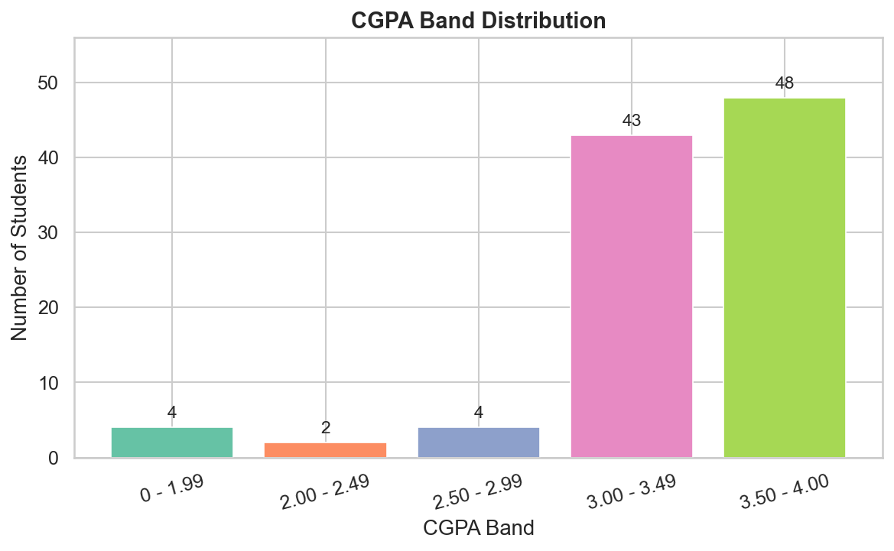

---

### 🔹 Mental Health Condition Prevalence
> Approximately 1 in 3 students reports each condition (depression: 35%, anxiety: 34%, panic attack: 33%), yet only 6% sought specialist treatment — the most striking finding in the dataset

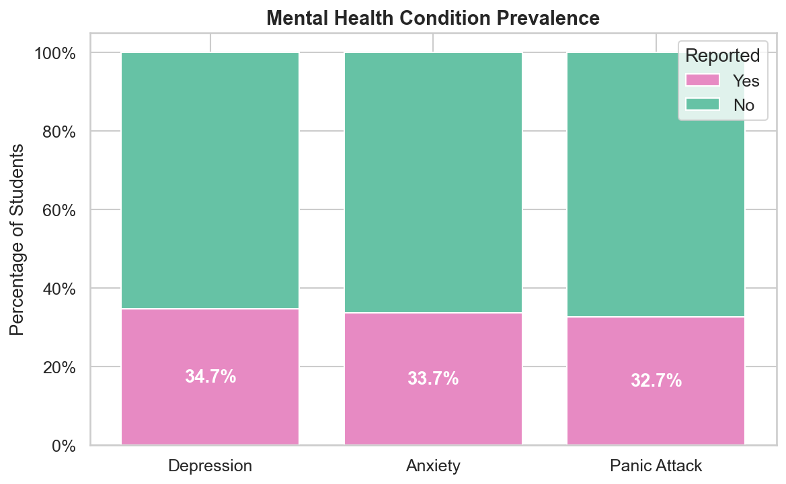

---

### 🔹 Mental Health Burden Score Distribution
> 37 students report no conditions, 36 report exactly one, 18 report two, and 10 report all three — showing significant co-occurrence of mental health conditions rather than isolated cases

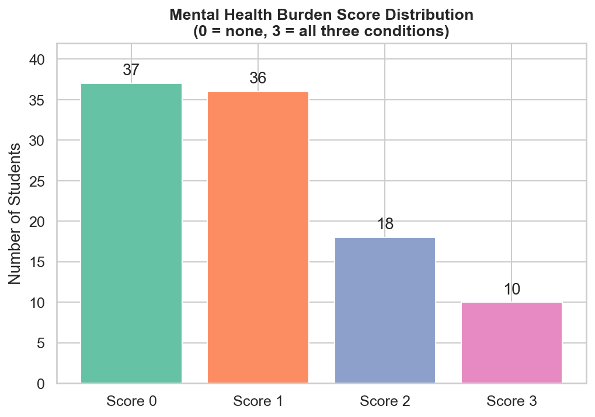

---

### 🔹 Depression / Anxiety / Panic Attack vs CGPA
> Side-by-side count and proportion charts for each condition across CGPA bands — shows that the 3.50–4.00 band has the highest absolute count of affected students (driven by its dominance in the sample), but proportional differences are modest given sample constraints

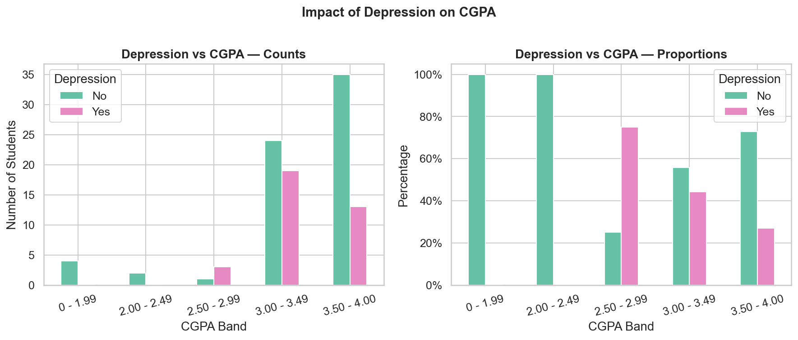
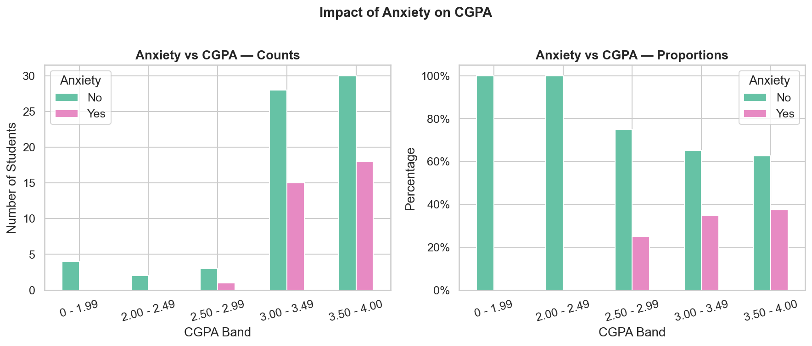
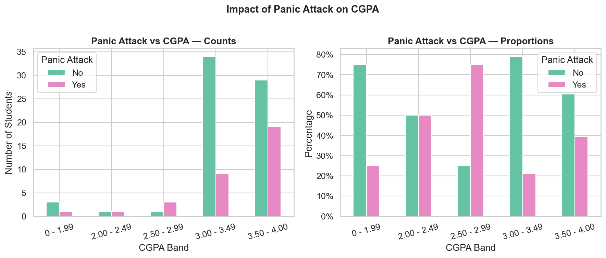

---

### 🔹 Course Group vs CGPA Heatmap
> Computing & IT (30 students) and Engineering (21) dominate the sample; Islamic Studies (21) shows the most distributed CGPA spread; all other faculties are too small for reliable inference

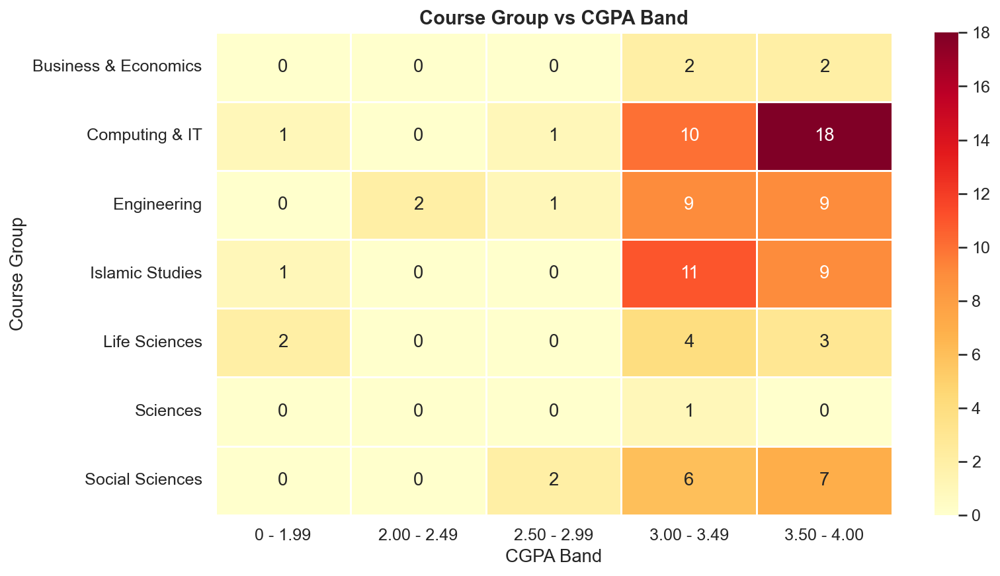

---

### 🔹 Feature Correlation Heatmap
> Lower triangular correlation matrix across all numeric features; depression, anxiety, and panic_attack are positively correlated with each other (r ≈ 0.3–0.5) confirming co-occurrence, while correlations with cgpa_label are weak (r < 0.1)

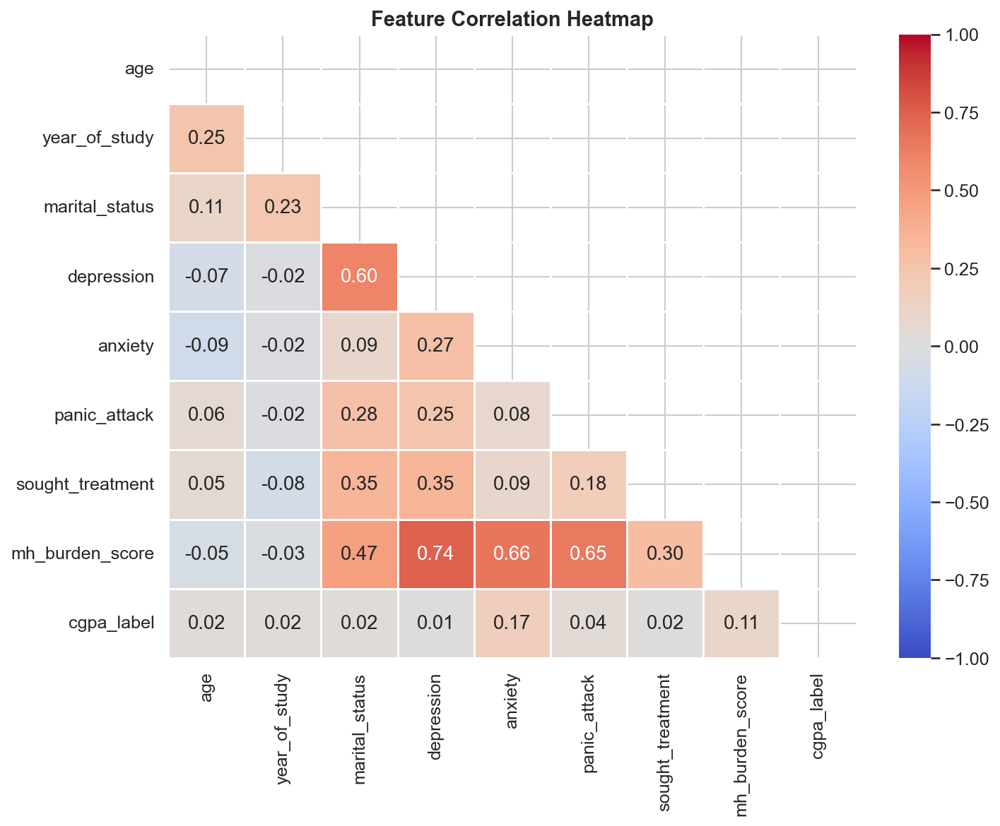

---

### 🔹 Model Performance Comparison
> Logistic Regression leads with Weighted F1 = 0.45 and Accuracy = 42.9%; SVM performs poorest (Weighted F1 = 0.11). All models underperform against a 5-class random baseline of 20% — driven by near-zero test samples in classes 0 and 1, not model failure

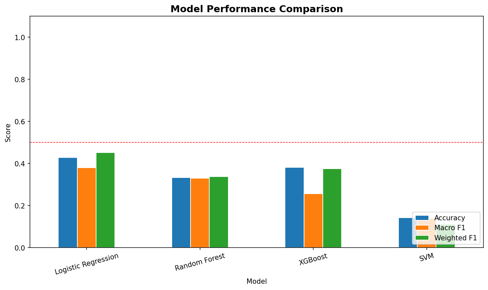

---

### 🔹 Confusion Matrices
> Per-model confusion matrices showing predicted vs actual CGPA bands across all four classifiers

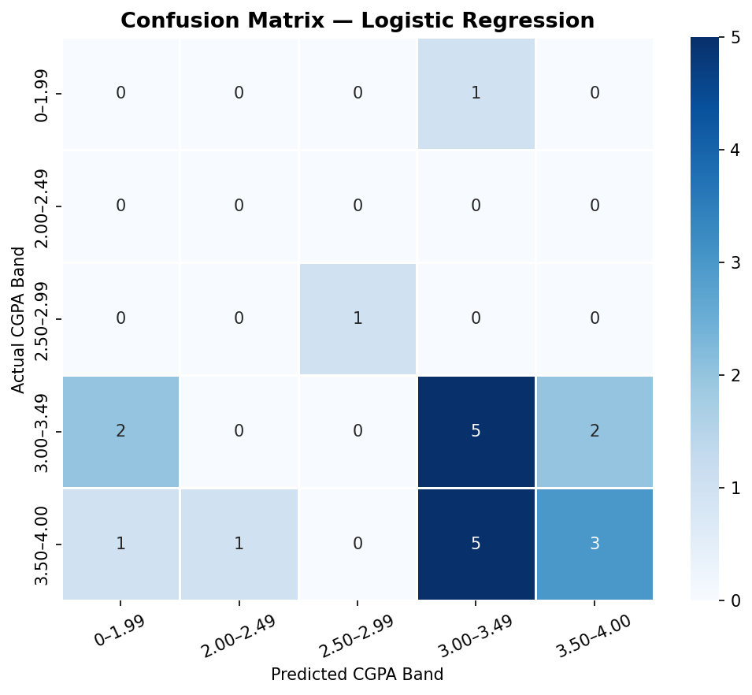
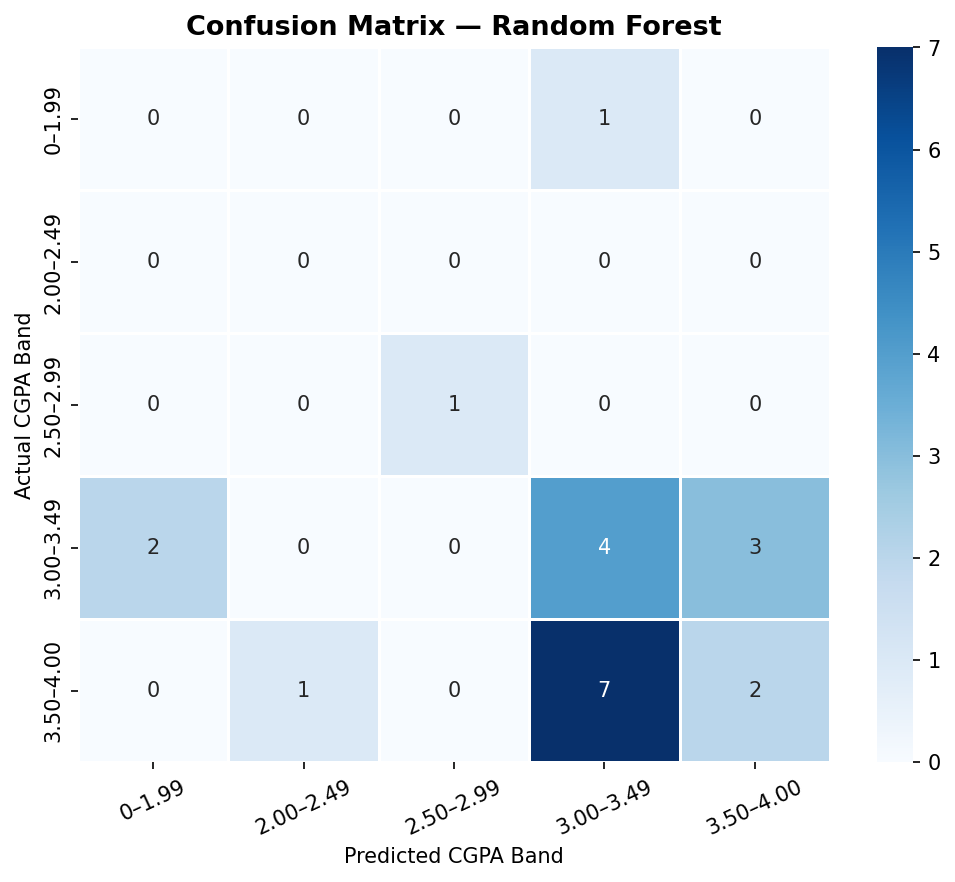
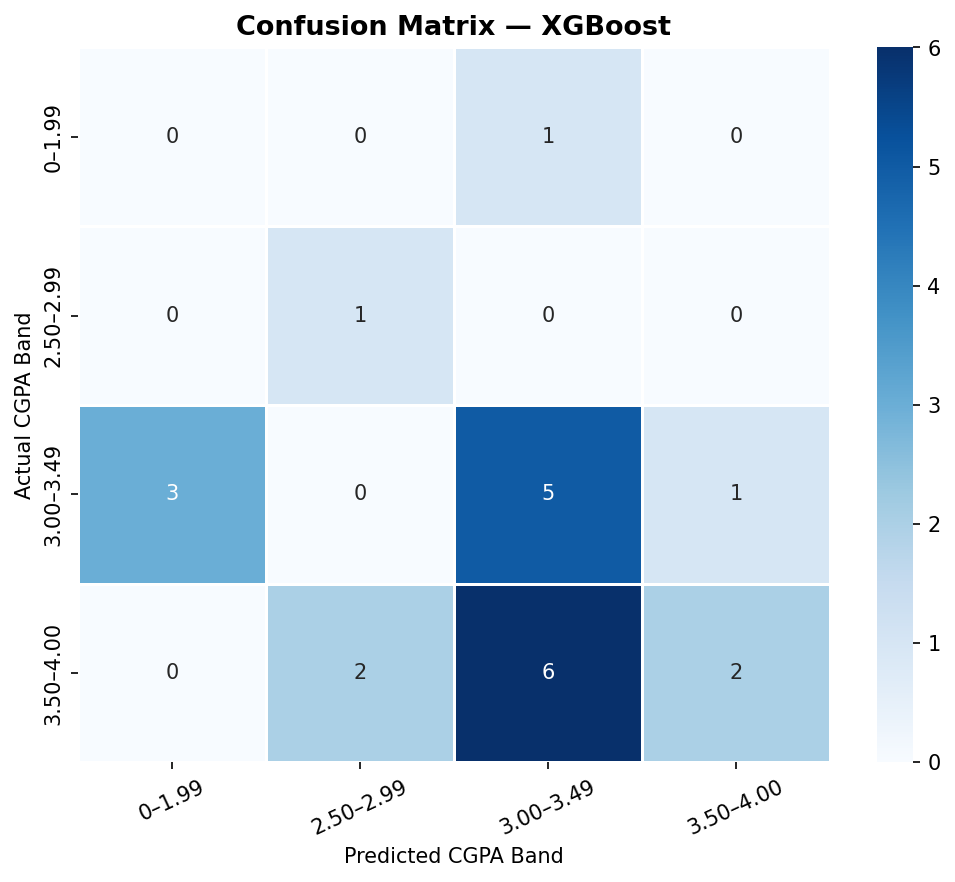
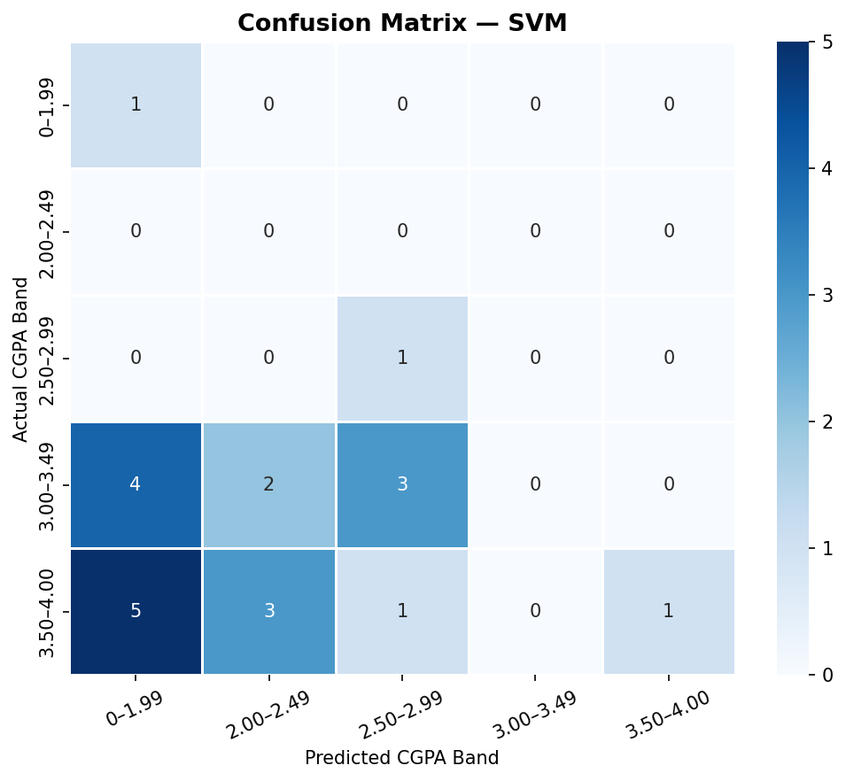

---

### 🔹 SHAP Feature Importance — Logistic Regression
> Stacked horizontal bar chart showing mean absolute SHAP value per feature per CGPA class; year_of_study, age, and mh_burden_score emerge as the strongest predictors; binary MH flags have lower individual impact than the composite score

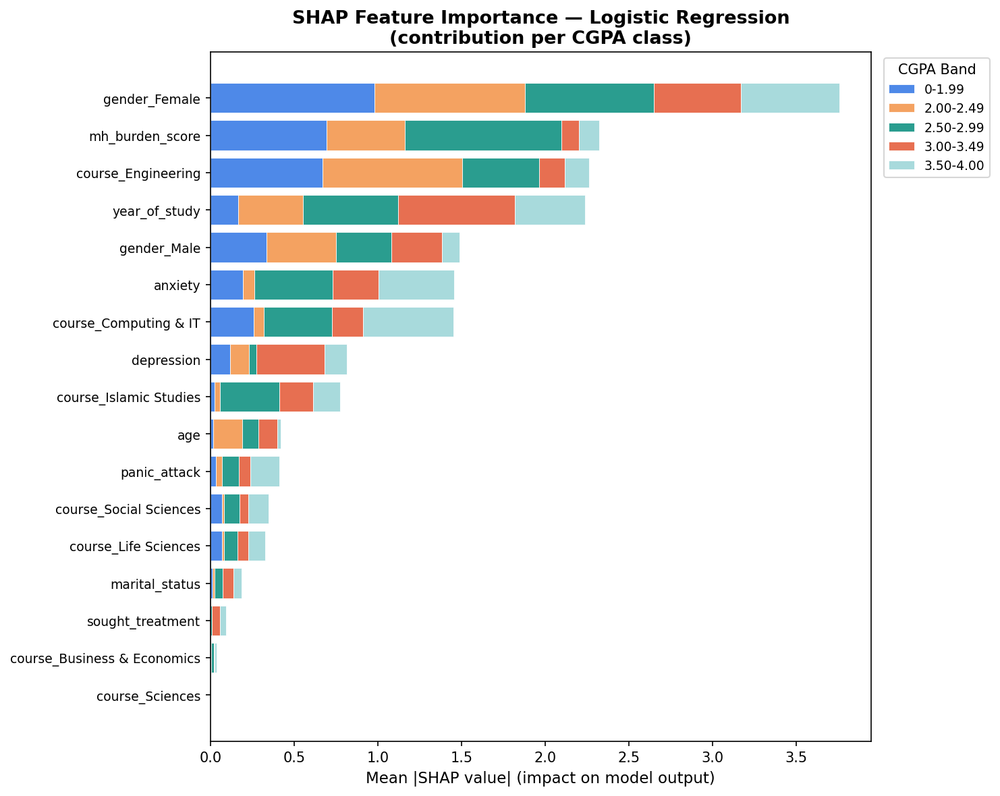

> 📌 *All visualisations are saved at high resolution in `/outputs/figures/`.*

---

## 📈 Results & Insights

### Model Performance Summary

| Model | Accuracy | Macro F1 | Weighted F1 | ROC-AUC |
|-------|----------|----------|-------------|---------|
| **Logistic Regression** | **0.4286** | **0.3800** | **0.4524** | — |
| XGBoost | 0.3810 | 0.2568 | 0.3744 | — |
| Random Forest | 0.3333 | 0.3295 | 0.3379 | — |
| SVM | 0.1429 | 0.1394 | 0.1111 | — |

> ROC-AUC is undefined due to 0 test samples in CGPA class 1 (2.00–2.49) — a dataset limitation, not a code error.

### Chi-Square Test Results

| Feature | Chi² | p-value | dof | Result |
|---------|------|---------|-----|--------|
| depression | 8.9975 | 0.0612 | 4 | ✗ Not significant |
| anxiety | 3.5243 | 0.4742 | 4 | ✗ Not significant |
| panic_attack | 7.3752 | 0.1173 | 4 | ✗ Not significant |
| mh_burden_score | 8.7773 | 0.7218 | 12 | ✗ Not significant |

### Key Insights

- 🔍 **Treatment gap is the headline finding:** Only 6% of students experiencing mental health conditions sought specialist help — a systemic under-utilisation of welfare services that warrants direct institutional intervention independent of the modelling results
- 🔍 **Co-occurrence dominates isolated conditions:** Depression, anxiety, and panic attacks cluster together (positive pairwise correlations r ≈ 0.3–0.5), suggesting shared stressors rather than distinct disorders — the composite burden score is a stronger predictor than any single flag
- 🔍 **Logistic Regression outperforms tree models:** On a small, noisy, imbalanced dataset, the simplest interpretable model wins — consistent with bias-variance tradeoff theory; complex models overfit the SMOTE-generated synthetic minority samples
- 🔍 **Chi-square non-significance is a power limitation:** p-values of 0.06–0.72 do not confirm absence of association — with n=101 and extreme class imbalance (classes of size 2–4), the test has insufficient statistical power to detect real effects
- 🔍 **Year of study and age are key predictors:** SHAP analysis reveals academic progression variables (year, age) contribute more to CGPA predictions than any individual mental health flag — students in later years tend toward higher CGPAs regardless of mental health status
- 🔍 **CGPA class imbalance is the core challenge:** 90% of students fall in the top two CGPA bands; classes 0 and 1 have 4 and 2 samples respectively — even perfect SMOTE cannot compensate for a test set with 0 or 1 samples per minority class

---

## 📁 Repository Structure

```
📦 Predicting Student CGPA from Mental Health Indicators/
│
├── 📂 data/
│   ├── raw/
│   │   └── Student_Mental_health.csv           # Original Google Forms survey dataset
│   └── processed/
│       ├── mindgrade_cleaned.csv               # Cleaned & feature-engineered dataset (Phase 1 output)
│       ├── mindgrade_features.csv              # One-hot encoded full feature set (Phase 3 output)
│       ├── mindgrade_features_resampled.csv    # SMOTE-resampled training set (Phase 3 output)
│       └── train_test_indices.pkl              # Serialised train/test splits & arrays (Phase 3 output)
│
├── 📂 src/
│   ├── phase1_data_cleaning.py                 # Data cleaning & normalisation pipeline
│   ├── phase2_eda.py                           # Exploratory data analysis & chi-square tests
│   ├── phase3_feature_engineering.py           # Encoding, SMOTE, train/test split
│   ├── phase4_modelling.py                     # Model training, evaluation, confusion matrices
│   ├── phase5_reporting.py                     # Self-contained HTML report generator
│   ├── generate_shap.py                        # Standalone SHAP feature importance figure
│   └── generate_pdf.py                         # Full ReportLab PDF report generator
│
├── 📂 notebooks/
│   └── MindGrade_Full_Analysis.ipynb           # End-to-end notebook chaining all 5 phases
│
├── 📂 outputs/
│   ├── figures/
│   │   ├── 01_cgpa_distribution.png            # CGPA band distribution bar chart
│   │   ├── 02_gender_distribution.png          # Gender pie chart
│   │   ├── 03_mh_prevalence.png                # Mental health prevalence stacked bar
│   │   ├── 04_mh_burden_score.png              # MH burden score distribution
│   │   ├── 05_depression_vs_cgpa.png           # Depression vs CGPA (count + proportion)
│   │   ├── 05_anxiety_vs_cgpa.png              # Anxiety vs CGPA (count + proportion)
│   │   ├── 05_panic_attack_vs_cgpa.png         # Panic attack vs CGPA (count + proportion)
│   │   ├── 06_age_distribution.png             # Age distribution bar chart
│   │   ├── 07_year_vs_cgpa.png                 # Year of study vs CGPA grouped bar
│   │   ├── 08_course_vs_cgpa_heatmap.png       # Course group vs CGPA heatmap
│   │   ├── 09_correlation_heatmap.png          # Feature correlation heatmap (lower triangle)
│   │   ├── 10_confusion_logistic_regression.png
│   │   ├── 10_confusion_random_forest.png
│   │   ├── 10_confusion_xgboost.png
│   │   ├── 10_confusion_svm.png
│   │   ├── 11_model_comparison.png             # 4-model performance bar chart
│   │   └── 12_shap_feature_importance.png      # SHAP stacked bar — per-class feature importance
│   │
│   ├── models/
│   │   ├── logistic_regression.pkl             # Trained Logistic Regression model
│   │   ├── random_forest.pkl                   # Trained Random Forest model
│   │   ├── xgboost.pkl                         # Trained XGBoost model
│   │   └── svm.pkl                             # Trained SVM model
│   │
│   └── reports/
│       ├── chi_square_results.csv              # Chi-square test results table
│       ├── model_results.csv                   # Model performance comparison table
│       ├── MindGrade_Report.html               # Self-contained HTML report (all figures embedded)
│       └── MindGrade_Report.pdf                # Full paginated PDF research report
│
├── requirements.txt                            # Python dependencies
└── README.md
```

---

## ▶️ How to Run

### Prerequisites

```bash
# Python 3.9+
# Anaconda or virtualenv recommended
```

```bash
# 1. Clone the repository
git clone https://github.com/YOUR_USERNAME/MindGrade.git
cd MindGrade

# 2. Install dependencies
pip install -r requirements.txt
```

### Run Each Phase in Order

```bash
# Phase 1 — Clean the raw dataset
python src/phase1_data_cleaning.py

# Phase 2 — Exploratory data analysis & chi-square tests
python src/phase2_eda.py

# Phase 3 — Feature engineering & SMOTE
python src/phase3_feature_engineering.py

# Phase 4 — Train & evaluate all four models
python src/phase4_modelling.py

# Generate SHAP feature importance figure
python src/generate_shap.py

# Phase 5 — HTML report
python src/phase5_reporting.py

# Generate PDF report
python src/generate_pdf.py
```

### Or Run Everything in the Notebook

```bash
jupyter notebook notebooks/MindGrade_Full_Analysis.ipynb
```
Run all cells top to bottom — each phase imports and calls the next automatically.

### Pipeline Outputs

| Output | Location | Generated By |
|--------|----------|--------------|
| Cleaned dataset | `data/processed/mindgrade_cleaned.csv` | Phase 1 |
| 11 EDA figures | `outputs/figures/01_*.png – 09_*.png` | Phase 2 |
| Chi-square results | `outputs/reports/chi_square_results.csv` | Phase 2 |
| Encoded + SMOTE data | `data/processed/mindgrade_features*.csv` | Phase 3 |
| 4 trained models | `outputs/models/*.pkl` | Phase 4 |
| Confusion matrices + comparison | `outputs/figures/10_*.png, 11_*.png` | Phase 4 |
| SHAP figure | `outputs/figures/12_shap_feature_importance.png` | generate_shap.py |
| HTML report | `outputs/reports/MindGrade_Report.html` | Phase 5 |
| PDF report | `outputs/reports/MindGrade_Report.pdf` | generate_pdf.py |

### Dependencies

```
pandas>=1.5.0
numpy>=1.23.0
scikit-learn>=1.2.0
xgboost>=1.7.0
imbalanced-learn>=0.10.0
matplotlib>=3.6.0
seaborn>=0.12.0
shap>=0.41.0
joblib>=1.2.0
reportlab>=3.6.0
jupyter>=1.0.0
scipy>=1.9.0
```

---

## ⚠️ Limitations & Future Work

**Current Limitations:**
- **Sample size (n=101)** is too small for reliable 5-class prediction — classes 0 and 1 have only 2–4 samples, making test-set evaluation statistically unreliable regardless of model quality
- **Single-university, single-country scope** limits generalisability — findings are specific to IIUM Malaysia and may not transfer to other cultural, socioeconomic, or academic contexts
- **Self-reported data** introduces social desirability bias — students may under-report mental health conditions due to stigma, particularly in a religious university setting
- **Cross-sectional design** — the survey captures a single moment in time; longitudinal data would be needed to establish causal direction between mental health and CGPA
- **Chi-square tests underpowered** — with n=101 and severe class imbalance, the tests lack statistical power to detect real associations even if they exist

**Future Improvements:**
- 📊 **Collapse to 3-class CGPA** (Low: 0–2.49 / Medium: 2.50–3.49 / High: 3.50–4.00) to address class imbalance and improve classification reliability
- 📈 **Expand the dataset** — replicate the survey across multiple Malaysian universities (UTM, UPM, UM) to reach n ≥ 500 and enable more robust modelling
- 🧠 **Add richer features** — sleep quality, social support index, financial stress rating, academic workload score, and family background variables
- 🔬 **Longitudinal tracking** — follow the same cohort across semesters to establish temporal relationships between mental health deterioration and CGPA decline
- 🤖 **Deep learning approaches** — experiment with TabNet or attention-based tabular models once sufficient data is available
- 🏥 **Prescriptive analytics** — build a student risk-scoring model to flag at-risk students for early counselling intervention, moving from prediction to actionable welfare policy

---

<div align="center">

## 👤 Author

**Name:** Agbozu Ebingiye Nelvin

🎓 Data Scientist | Machine Learning | Mental Health Analytics
📍 Nigeria

[](https://www.linkedin.com/in/agbozu-ebi/)
[](https://github.com/Nelvinebi)
[](mailto:nelvinebingiye@gmail.com)

</div>

---

## 📄 License

This project is licensed under the **MIT License** free to use, adapt, and build upon for research, education, and student welfare analytics.
See the [LICENSE](LICENSE) file for full details.

---

## 🙌 Acknowledgements

- **Shariful Islam** for collecting and publishing the IIUM Student Mental Health survey dataset on Kaggle, making this research possible
- **International Islamic University Malaysia (IIUM)** whose students participated in the original Google Forms survey
- **Scikit-learn & XGBoost** communities for the open-source machine learning frameworks powering the modelling pipeline
- **SHAP (Lundberg & Lee, 2017)** for the unified framework for interpretable machine learning that drives the feature importance analysis
- **imbalanced-learn** for the SMOTE implementation that enables training on severely imbalanced CGPA class distributions
- Research on student mental health in Malaysian higher education informed by published work from the **Malaysian Journal of Psychiatry** and **IIUM academic welfare studies**

---

<div align="center">

⭐ **If this project helped you, please consider starring the repo!**

*Part of a broader portfolio of data science and machine learning projects focused on education analytics and student welfare.*

🔗 [View All Projects](https://github.com/Nelvinebi) · [Connect on LinkedIn](https://www.linkedin.com/in/agbozu-ebi/)

</div>
